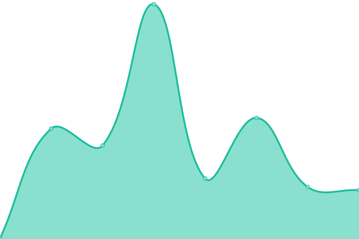

# [📈 Live Status](https://upptime.github.io/upptime): <!--live status--> **🟧 Partial outage**

This repository contains the open-source uptime monitor and status page for [Upptime](https://upptime.js.org), powered by [Upptime](https://github.com/upptime/upptime).

With [Upptime](https://upptime.js.org), you can get your own unlimited and free uptime monitor and status page, powered entirely by a GitHub repository. We use [Issues](https://github.com/upptime/upptime/issues) as incident reports, [Actions](https://github.com/pusimgit/upptime/actions) as uptime monitors, and [Pages](https://upptime.github.io/upptime) for the status page.

<!--start: status pages-->
<!-- This summary is generated by Upptime (https://github.com/upptime/upptime) -->
<!-- Do not edit this manually, your changes will be overwritten -->
<!-- prettier-ignore -->
| URL | Status | History | Response Time | Uptime |
| --- | ------ | ------- | ------------- | ------ |
|  [SIAKAD](https://siakad.unmer.ac.id/) | 🟥 Down | [siakad.yml](https://github.com/pusimgit/upptime/commits/HEAD/history/siakad.yml) | 

 2685ms
     
 | 

<a href="https://status.unmer.ac.id/history/siakad">43.17%</a>
    

|  [PMB](https://pmb.unmer.ac.id/) | 🟥 Down | [pmb.yml](https://github.com/pusimgit/upptime/commits/HEAD/history/pmb.yml) | 

 3384ms
     
 | 

<a href="https://status.unmer.ac.id/history/pmb">56.41%</a>
    

|  [SDM](https://sdm.unmer.ac.id/) | 🟥 Down | [sdm.yml](https://github.com/pusimgit/upptime/commits/HEAD/history/sdm.yml) | 

 3718ms
     
 | 

<a href="https://status.unmer.ac.id/history/sdm">71.02%</a>
    

|  [Payment Gateway](https://payment.unmer.ac.id/) | 🟨 Degraded | [payment-gateway.yml](https://github.com/pusimgit/upptime/commits/HEAD/history/payment-gateway.yml) | 

 10305ms
     
 | 

<a href="https://status.unmer.ac.id/history/payment-gateway">84.35%</a>
    

|  [API](https://api.unmer.ac.id/) | 🟨 Degraded | [api.yml](https://github.com/pusimgit/upptime/commits/HEAD/history/api.yml) | 

 9827ms
     
 | 

<a href="https://status.unmer.ac.id/history/api">89.23%</a>
    

|  [BP3M](https://bp3m.unmer.ac.id/) | 🟩 Up | [bp-3-m.yml](https://github.com/pusimgit/upptime/commits/HEAD/history/bp-3-m.yml) | 

 1994ms
     
 | 

<a href="https://status.unmer.ac.id/history/bp-3-m">89.84%</a>
    

|  [MBKM](https://mbkm.unmer.ac.id/) | 🟩 Up | [mbkm.yml](https://github.com/pusimgit/upptime/commits/HEAD/history/mbkm.yml) | 

 7102ms
     
 | 

<a href="https://status.unmer.ac.id/history/mbkm">85.25%</a>
    

|  [MBKM Cloud](https://mbkm-cloud.unmer.ac.id/) | 🟩 Up | [mbkm-cloud.yml](https://github.com/pusimgit/upptime/commits/HEAD/history/mbkm-cloud.yml) | 

 2569ms
     
 | 

<a href="https://status.unmer.ac.id/history/mbkm-cloud">100.00%</a>
    

|  [eClass](https://eclass.unmer.ac.id/) | 🟩 Up | [e-class.yml](https://github.com/pusimgit/upptime/commits/HEAD/history/e-class.yml) | 

 9872ms
     
 | 

<a href="https://status.unmer.ac.id/history/e-class">91.58%</a>
    

|  [Eprints](https://eprints.unmer.ac.id) | 🟩 Up | [eprints.yml](https://github.com/pusimgit/upptime/commits/HEAD/history/eprints.yml) | 

 9526ms
     
 | 

<a href="https://status.unmer.ac.id/history/eprints">85.17%</a>
    

|  [Jurnal](https://jurnal.unmer.ac.id) | 🟩 Up | [jurnal.yml](https://github.com/pusimgit/upptime/commits/HEAD/history/jurnal.yml) | 

 2593ms
     
 | 

<a href="https://status.unmer.ac.id/history/jurnal">99.00%</a>
    

|  [Elibs](https://elibs.unmer.ac.id) | 🟨 Degraded | [elibs.yml](https://github.com/pusimgit/upptime/commits/HEAD/history/elibs.yml) | 

 16377ms
     
 | 

<a href="https://status.unmer.ac.id/history/elibs">0.00%</a>
    

|  [Library](https://library.unmer.ac.id) | 🟨 Degraded | [library.yml](https://github.com/pusimgit/upptime/commits/HEAD/history/library.yml) | 

 9986ms
     
 | 

<a href="https://status.unmer.ac.id/history/library">86.11%</a>
    

|  [Google DNS 1](8.8.4.4) | 🟩 Up | [google-dns-1.yml](https://github.com/pusimgit/upptime/commits/HEAD/history/google-dns-1.yml) | 

 3ms
     
 | 

<a href="https://status.unmer.ac.id/history/google-dns-1">100.00%</a>
    

<!--end: status pages-->

[**Visit our status website →**](https://upptime.github.io/upptime)

## 📄 License

- Powered by: [Upptime](https://github.com/upptime/upptime)
- Code: [MIT](./LICENSE) © [Upptime](https://upptime.js.org)
- Data in the `./history` directory: [Open Database License](https://opendatacommons.org/licenses/odbl/1-0/)
